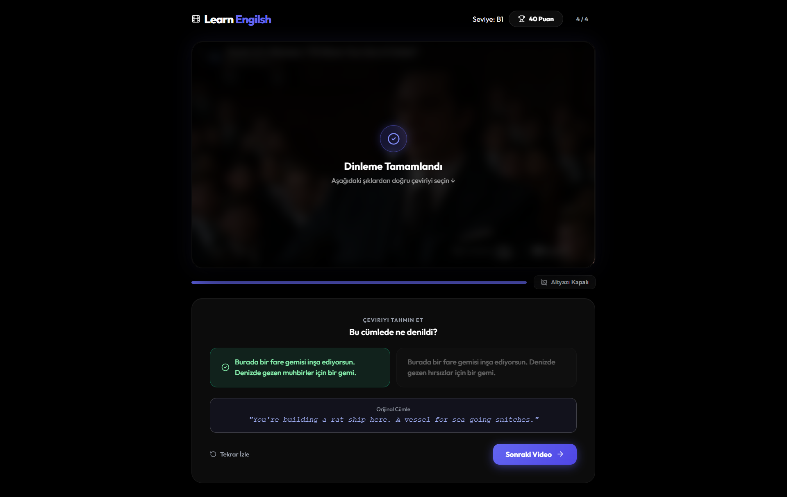

<div align="center">
  <h1>Leplay: AI-Powered Language Learning</h1>
  <p>Learn English through highly curated, perfectly translated YouTube movie and TV show clips.</p>

  [](https://reactjs.org/)
  [](https://vitejs.dev/)
  [](https://groq.com)
</div>

<br />

## 🌟 Overview

**Leplay** is a modern, interactive language learning platform designed to help users master English by listening to natural, native conversations from YouTube videos. It recreates the classic "Leplay" experience but supercharges it with an automated **AI processing pipeline**.

Instead of manually curating scenes and writing translations, the backend processor uses **Llama 3.3 (via Groq)** in a multi-stage pipeline to identify the best, short, punchy scenes, translate them flawlessly, and generate clever distractor options for the quizzes.




## ✨ Features

- **Automated Scene Extraction**: Paste any YouTube URL, and the AI automatically scans the subtitles to extract the best 1-2 sentence scenes.
- **Flawless Localization**: Groq AI acts as a Netflix subtitle editor to guarantee complete, idiomatic Turkish translations without missing any sentences.
- **Clever Distractors**: Generates plausible but incorrect distractor options for the quiz to test the user's comprehension.
- **Perfect Video Sync**: Direct integration with the YouTube IFrame Player API ensures videos pause exactly at the millisecond the scene ends.
- **Premium UI/UX**: Built with React and Framer Motion, featuring glassmorphism, fluid animations, and a responsive, immersive dark-mode design.

## 🚀 Getting Started

### Prerequisites
- Node.js (v18+)
- A valid Groq API Key

### Installation

1. **Clone the repository** and install dependencies:
   ```bash
   npm install
   ```

2. **Environment Setup**:
   Create a `.env` file in the root directory and add your Groq API key:
   ```env
   GROQ_API_KEY=your_api_key_here
   ```

3. **Run the Application**:
   ```bash
   npm run dev
   ```
   *The app will be available at `http://localhost:5173`.*

## 🧠 Using the AI Processor

To add new videos to the platform, use the built-in AI processor script. It automatically downloads subtitles, finds the best clips, translates them, and updates your database (`src/data/videos.json`).

```bash
# Provide a valid YouTube URL
node scripts/processor.js "https://www.youtube.com/watch?v=Jd10x8LiuBc"
```

**Pipeline Workflow:**
1. **Fetch**: `youtube-transcript` pulls the English captions.
2. **Select**: AI (Llama 3.3) analyzes the text and selects 3-4 short, punchy segments.
3. **Clean**: The script removes newlines to provide a clean string.
4. **Translate & Generate**: AI provides a flawless, literal Turkish translation of the entire segment and generates a "wrong" option.
5. **Save**: The processed data is pushed to `videos.json`.

---
<div align="center">
  <i>Built with ❤️ for English learners.</i>
</div>
