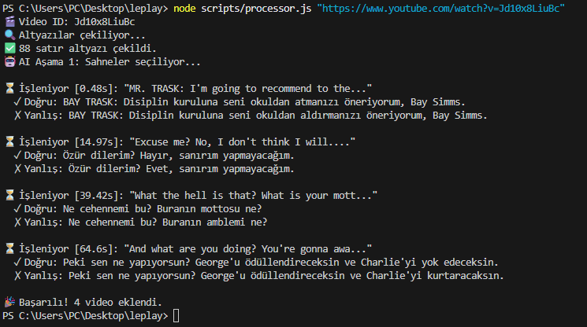

<div align="center">
  <h1>Leplay: AI-Powered Language Learning</h1>
  <p>Learn English through highly curated, perfectly translated YouTube movie and TV show clips.</p>

  [](https://reactjs.org/)
  [](https://vitejs.dev/)
  [](https://groq.com)
</div>

<br />

## 🌟 Overview

**Leplay** is a modern, interactive language learning platform designed to help users master English by listening to natural, native conversations from YouTube videos. It recreates the classic "Leplay" experience but supercharges it with an automated **AI processing pipeline**.

Instead of manually curating scenes and writing translations, the backend processor uses **Llama 3.3 (via Groq)** in a multi-stage pipeline to identify the best, short, punchy scenes, translate them flawlessly, and generate clever distractor options for the quizzes.


## ✨ Features

- **Automated Scene Extraction**: Paste any YouTube URL, and the AI automatically scans the subtitles to extract the best 1-2 sentence scenes.
- **Flawless Localization**: Groq AI acts as a Netflix subtitle editor to guarantee complete, idiomatic Turkish translations without missing any sentences.
- **Clever Distractors**: Generates plausible but incorrect distractor options for the quiz to test the user's comprehension.
- **Perfect Video Sync**: Direct integration with the YouTube IFrame Player API ensures videos pause exactly at the millisecond the scene ends.
- **Premium UI/UX**: Built with React and Framer Motion, featuring glassmorphism, fluid animations, and a responsive, immersive dark-mode design.

## 🚀 Getting Started

Follow these steps to run the project locally on your machine.

### 1. Prerequisites
- **Node.js**: Ensure you have Node.js (v18 or higher) installed on your system.
- **Groq API Key**: The backend processor requires the Llama 3.3 model to curate and translate videos. You need to obtain a free API key from Groq.

### 2. Groq AI Setup
Groq is required for the "automated video processing" pipeline to function.
1. Go to the [Groq Console](https://console.groq.com/) and create an account.
2. Navigate to the **API Keys** section from the left sidebar.
3. Click the **Create API Key** button, generate a new key, and copy it.

### 3. Project Setup

After cloning or downloading the repository, navigate to the project folder via your terminal and install the required dependencies:

```bash
# Install dependencies
npm install
```

Create a new file named `.env` in the root directory of the project, and paste your copied Groq API key into it:

```env
GROQ_API_KEY=gsk_your_long_api_key_goes_here
```

### 4. Starting the Site

Once the setup is complete, start the application by running:

```bash
npm run dev
```

Open your browser and navigate to the link provided in the terminal (usually `http://localhost:5173`) to start using **Leplay**!

---

## 🧠 Adding New Videos (AI Processor)

The core strength of Leplay is its ability to transform any YouTube video into a perfect English comprehension test in seconds. To feed the system with new content, open a separate terminal window and use the following command:

```bash
# Append any valid YouTube URL to the command:
node scripts/processor.js "https://www.youtube.com/watch?v=Jd10x8LiuBc"
```




### ⚙️ How the Pipeline Works

| Stage | What it Does | Technology Used |
| :--- | :--- | :--- |
| **1. Fetch** | Downloads the original English subtitles directly from the YouTube video. | `youtube-transcript` |
| **2. Select** | Reads the entire transcript and curates the most suitable, catchy 1-2 sentence scenes for language learning. | `Groq (Llama 3.3)` |
| **3. Clean** | Clears out irregular spaces, line breaks (`\n`), and artifacts from the selected scenes. | `JavaScript (Regex)` |
| **4. Translate & Distract** | Translates the scene flawlessly into idiomatic Turkish (Netflix dubbing quality). Then, it generates a "distractor" option that looks very similar but changes the meaning to test the user. | `Groq (Llama 3.3)` |
| **5. Save** | Injects all the processed data into the `src/data/videos.json` file. The application updates instantly. | `Node.js (fs)` |

> **Note:** You do not need to refresh the page after adding a video; Leplay (React) automatically detects the new questions and makes them available for playback immediately.

